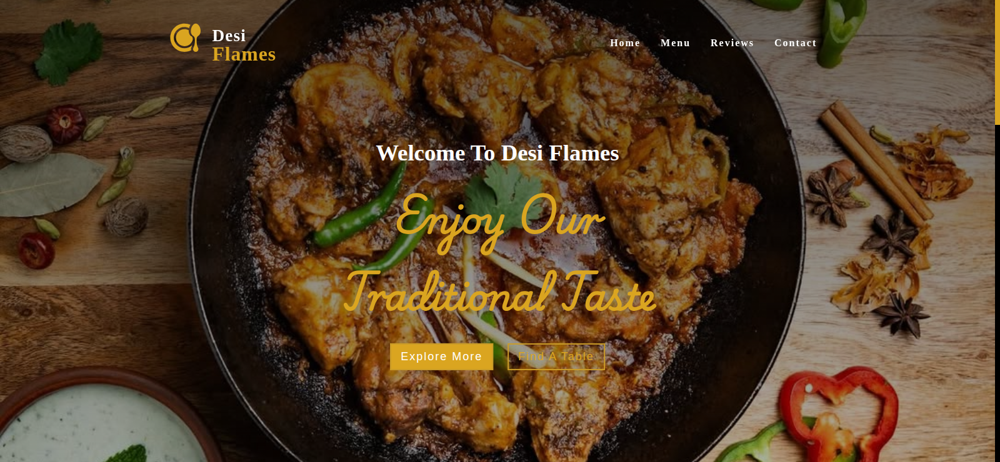
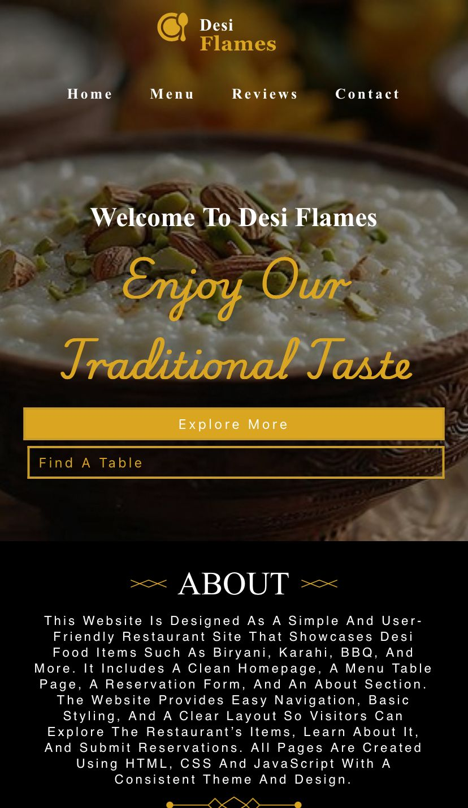

# DesiFlames - Authentic Desi Restaurant Website

Welcome to **DesiFlames**, a beautifully designed restaurant website showcasing traditional desi cuisine! This project is built entirely using **HTML, CSS, and JavaScript**, featuring a responsive and user-friendly interface.

---

## 🏠 Pages

The website contains the following pages:

- **Home** - A welcoming landing page with restaurant highlights and slogan.
- **Reservation** - A visually appealing reservation form (frontend-only) for users to plan their visits.
- **Menu** - Display of all your delicious dishes, including biryani, karhai, and more.
- **Reviews** - Customer feedback section showcasing testimonials.
- **Contact** - Feedback form and location information for the restaurant.

---

## ✨ Features That Make It Beautiful

- **Responsive Design** - Works smoothly on desktops, tablets, and mobile devices.
- **Modern UI** - Clean layout, consistent color scheme, and elegant fonts.
- **Interactive Elements** - Hover effects on buttons, smooth scrolling, and subtle animations.
- **High-Quality Images** - Mouth-watering images of dishes to entice users.
- **Navigation Bar** - Stays on top for easy access to all pages.

---
## 👥 Project Team

This website was developed by:

- **Abdullah Aziz**  
- **Shahyan Haider** 
- **Mustafa Khan**  
---

## 📷 Screenshots

### 💻 Desktop View
    

### 📱 Mobile View
  

---

## 🌐 Live Demo

Check out the live demo of the frontend-only website here:  
[**Live Demo**](https://techabby.github.io/Website-Project-IT)  

> Note: Reservation form and other backend functionality are not functional since this is frontend-only.

---

## 📝 License

This project is free to use by anyone for any purpose.  
You can **copy, modify, distribute, or use it** without any restrictions.

---

## 💡 Why It Stands Out

- Elegant design that reflects **traditional desi culture**  
- Fully responsive, clean, and modern UI  
- Engaging user experience with smooth transitions, hover effects, and well-organized content  

---

## 📩 Contact

For suggestions or feedback, feel free to contact me at: **abbyheere@gmail.com**

---
<h3 align="center">Happy Coding!</h3>